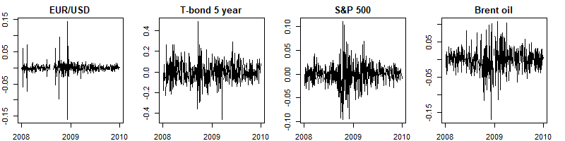

```{r setup, include=FALSE}
knitr::opts_chunk$set(echo = TRUE)
```

## Change In Volatility Over Time

| Financial risk has many faces, and we measure it in many ways, but for now, let's agree that it is a measure of the possible loss on an investment. In financial markets, where we measure prices frequently, volatility (which is analogous to *standard deviation*) is an obvious choice to measure risk. But in real markets, volatility changes with the market itself.
| 
| 
  

| 
  The image presented depicts the returns of four distinct assets, each displaying a pattern of alternating periods of high and low volatilities. Notably, the greatest volatility occurred near the conclusion of 2008, which coincided with the most severe stage of the recent financial crisis.

```{r}

library(xts)
library(readr)

# Load the data
yc_raw <- read_csv("FED-SVENY.csv")

# Convert the data into xts format
yc_all <- as.xts(x = yc_raw[, -1], order.by = yc_raw$Date)

# Show only the tail of the 1st, 5th, 10th, 20th and 30th columns
yc_all_tail <- tail(yc_all[, c(1,5,10,20, 30)])
yc_all_tail


```

```{r}


```
